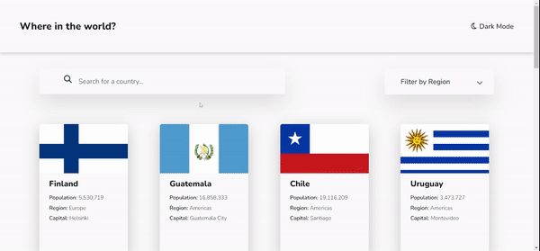

3# Frontend Mentor - REST Countries API with color theme switcher solution

This is a solution to the [REST Countries API with color theme switcher challenge on Frontend Mentor](https://www.frontendmentor.io/challenges/rest-countries-api-with-color-theme-switcher-5cacc469fec04111f7b848ca). Frontend Mentor challenges help you improve your coding skills by building realistic projects.

## Table of contents

- [Overview](#overview)
  - [The challenge](#the-challenge)
  - [Screenshot](#screenshot)
  - [Links](#links)
- [My process](#my-process)
  - [Built with](#built-with)
  - [What I learned](#what-i-learned)
  - [Continued development](#continued-development)
  - [Useful resources](#useful-resources)
- [Author](#author)
- [Acknowledgments](#acknowledgments)

**Note: Delete this note and update the table of contents based on what sections you keep.**

## Overview

### The challenge

Users should be able to:

- See all countries from the API on the homepage
- Search for a country using an `input` field
- Filter countries by region
- Click on a country to see more detailed information on a separate page
- Click through to the border countries on the detail page
- Toggle the color scheme between light and dark mode _(optional)_

### GIF

### Links

- Solution URL: [Add solution URL here](https://your-solution-url.com)
- Live Site URL: [Add live site URL here](https://your-live-site-url.com)

## My process

1- Taking a Look at the desgin.
2- Deciding the HTML Structure and Elements Used for each section.
3- Deciding CSS class names To follow BEM.
4- Using 7-1 Architecture to divide my styles into multiple files which is easier to modify and maintain.
5- Then decide which element styles goes into which file.
6- Then Creating a flowchart for Application functionalites
7- Then Creating an Architecture diagram for the different classes and methods i am going to create.
8- Finally implementing different features of my application using vanilla javascript.

//Note: Initial Flowchart and architecture diagrams are not final they may be changed dramatically during implementation, also some features may be added during        implementaion.

### Built with

- Semantic HTML5 markup
- CSS custom properties
- Flexbox
- CSS Grid
- Mobile-first workflow
- Sass
- 7-1 Architecture
- Vanilla Javascript
- OOP Structure
- REST Countries API

### What I learned

1- How to implement Lazy loading using intersection observer API.
2- Loading api css animation library
3- To create More generic methods

## Author

- Frontend Mentor - [@Ezzat-Abdelrazek]([https://www.frontendmentor.io/profile/yourusername](https://www.frontendmentor.io/profile/Ezzat-Abdelrazek))
